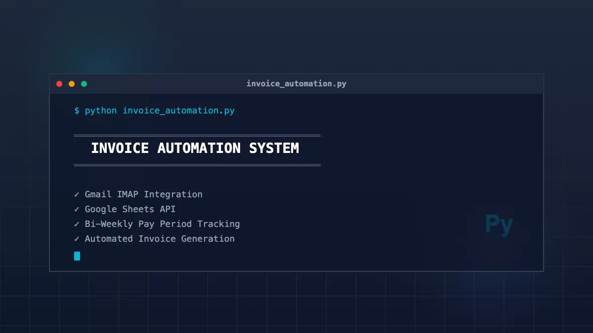

# Invoice Automation

Python CLI tool for automating bi-weekly invoice generation from schedule emails

**Tech Stack:** Python, Google Sheets API, Gmail IMAP/SMTP

**Key Features:** Email parsing • Auto hour calculation • Google Sheets integration • PDF/Excel export • Email delivery • Manual shift editing • Tax summaries

**Why I built it:** Reduced invoicing time by ~80%. Replaced manual process of copying shifts, calculating hours, updating spreadsheets, exporting files, and sending emails.

<b>Built With</b>

## Technical Details

**Email Processing**
- IMAP connection to Gmail
- Regex parsing for old and new Homebase email formats
- Automatic shift extraction with duplicate detection

**Invoice Generation**
- Google Sheets API for spreadsheet creation
- Template copying via Google Drive API
- Auto hour calculation with HST (13%)
- Sequential invoice numbering

**Data Management**
- JSON storage for shifts and invoice tracking
- Configurable bi-weekly pay period detection
- Manual shift editing, adding, deletion

**Export & Delivery**
- PDF/Excel export with custom formatting
- SMTP email with attachments
- Interactive CLI with shift review before sending

## License

This project is licensed under the [MIT](https://opensource.org/licenses/MIT) license.

## Questions
For questions, email me at devkyoriku@gmail.com.